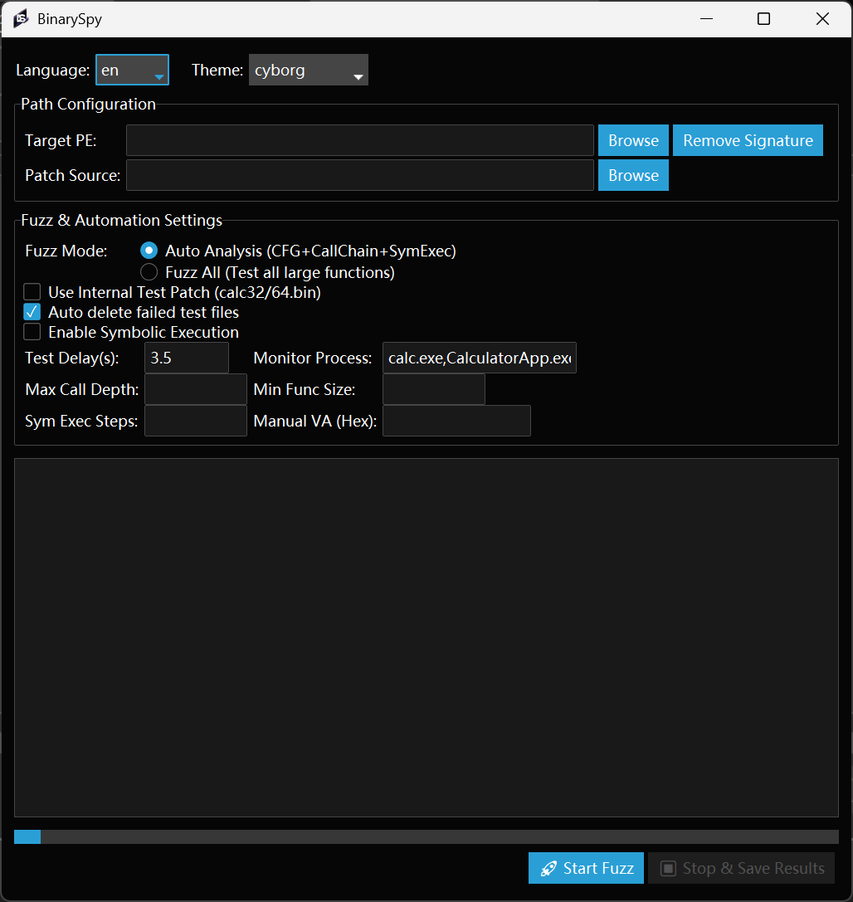
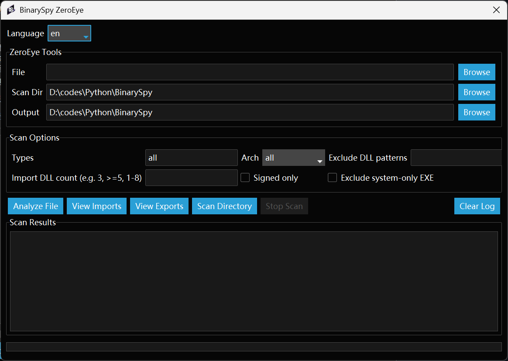
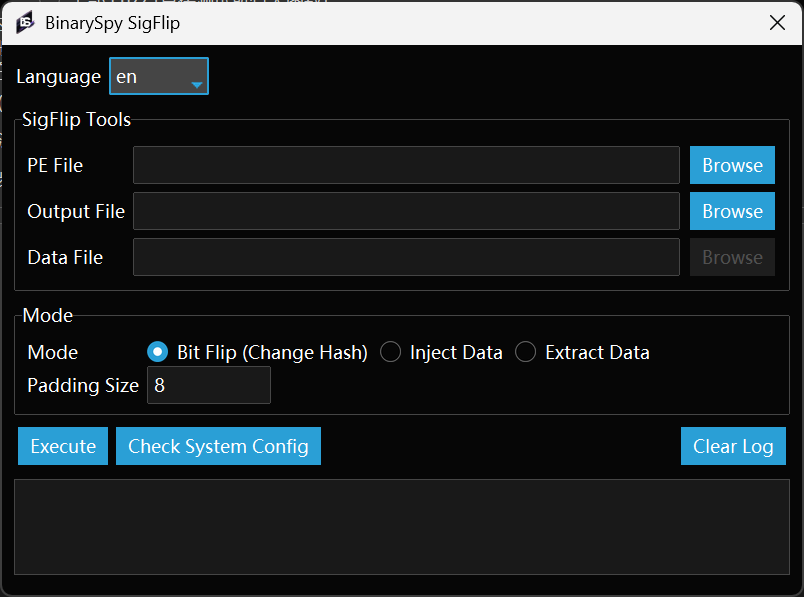

# BinarySpy

> A tool for automatic patch shellcode into binary file to bypass AV.
>
> 一个自动patch shellcode到二进制文件的工具

## [zh_README](zh_README.md)

## Features

- **Two Fuzz Modes**
  - Auto Analysis: CFG + Call Chain + Symbolic Execution verification
  - Fuzz All: Test all large functions directly
- **Smart Function Filtering** - Filter by call depth, function size, and symbolic execution reachability
- **Symbolic Execution Verification** - Verify functions are actually reachable from entry point
- **Digital Signature Removal** - Remove PE signature with auto backup
- **Modern Dark Theme UI** - Multiple theme options with ttkbootstrap
- **Multi-language Support** - Chinese/English interface
- **Cache System** - Speed up repeated analysis

## Additional Tools

### ZeroEye

ZeroEye is an automated DLL hijacking scanner that supports native PE, .NET programs, and kernel drivers.

**Features:**

- **Native PE Scan**: Scan import table, auto-copy non-system DLLs, generate proxy DLL templates
- **.NET Scan**: Detect Config hijack/P/Invoke/Assembly side-loading vectors
- **Kernel Driver Scan**: Scan IOCTL + dangerous APIs (skip MS signed drivers)
- **C++ Class Rebuild**: Rebuild C++ class from MSVC decorated names, generate 3 proxy templates

**Usage:** Click `ZeroEye` button in the main window to open the tool.

### SigFlip

SigFlip is a signature manipulation tool using certificate table padding technique.

**Features:**

- **Bit Flip**: Add random padding to change PE hash without breaking signature
- **Inject**: Embed custom data into certificate area with `BinarySpy` magic tag
- **Extract**: Extract embedded data from modified PE files

**Usage:** Click `SigFlip` button in the main window to open the tool.

## Screenshots







## Quick Start

### Requirements

```bash
pip install pefile angr psutil ttkbootstrap
```

### Usage

1. Select target PE file
2. Select patch source (or use built-in test patch)
3. Choose Fuzz mode:
   - **Auto Analysis**: Recommended for most cases
   - **Fuzz All**: Brute force all large functions
4. Configure parameters:
   - Test Delay: Time to wait for process spawn
   - Monitor Process: Process name to detect (e.g., `calc.exe`)
   - Max Call Depth: Filter functions by call depth
   - Min Function Size: Minimum function size to test
   - Symbolic Execution Steps: Only when symbolic execution is enabled
5. Click **Start Fuzz**

## Mode Comparison

| Feature              | Auto Analysis | Fuzz All |
| -------------------- | ------------- | -------- |
| CFG Analysis         | Full          | Basic    |
| Call Chain Tracking  | Yes           | No       |
| Symbolic Execution   | Optional      | No       |
| Call Depth Filter    | Yes           | No       |
| Function Size Filter | Yes           | Yes      |
| Speed                | Slower        | Faster   |

## Parameters

| Parameter         | Description                                                                       |
| ----------------- | --------------------------------------------------------------------------------- |
| Test Delay        | Seconds to wait before checking if target process spawned                         |
| Monitor Process   | Process name(s) to monitor, comma separated (e.g.,`calc.exe,CalculatorApp.exe`) |
| Max Call Depth    | Only test functions within this depth from entry point                            |
| Min Function Size | Only test functions larger than this size                                         |
| Sym Exec Steps    | Maximum steps for symbolic execution verification                                 |

## Theme Options

Available dark themes:

- `cyborg` - Dark gray/cyan (default)
- `darkly` - Dark blue/white
- `vapor` - Dark purple/pink
- `superhero` - Dark gray/orange
- `pulse` - Dark gray/blue

## Tips

- Use larger PE files as targets
- Prefer PE files with GUI subsystem (no console window)
- Keep shellcode small for better results
- For custom shellcode, use [CppDevShellcode](https://github.com/clownfive/CppDevShellcode)

## Workflow

```
Entry Point → CRT → Main → Target Functions
                ↓
         CFG Analysis
                ↓
         Call Chain Tracking
                ↓
         Symbolic Execution (optional)
                ↓
         Fuzz Testing
                ↓
         Success Detection
```

## References

- [Original Analysis](https://www.52pojie.cn/thread-1900852-1-1.html)
- [old_README](old_README.md)
- [Zeroeye](https://github.com/ImCoriander/ZeroEye)
- [SigFlip](https://github.com/med0x2e/SigFlip)
- [PECracker](https://github.com/berryalen02/PECracker)

## Disclaimer

This project is for educational and authorized security testing purposes only. Users are responsible for ensuring compliance with applicable laws and regulations. The author assumes no liability for any misuse or damage caused by this tool.

## Star History

<a href="https://star-history.com/#yj94/BinarySpy&Date">
 <picture>
   <source media="(prefers-color-scheme: dark)" srcset="https://api.star-history.com/svg?repos=yj94/BinarySpy&type=Date&theme=dark" />
   <source media="(prefers-color-scheme: light)" srcset="https://api.star-history.com/svg?repos=yj94/BinarySpy&type=Date" />
   
 </picture>
</a>
