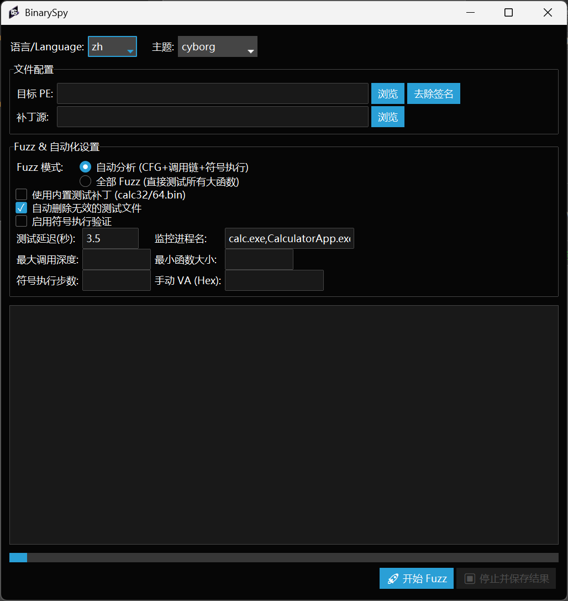
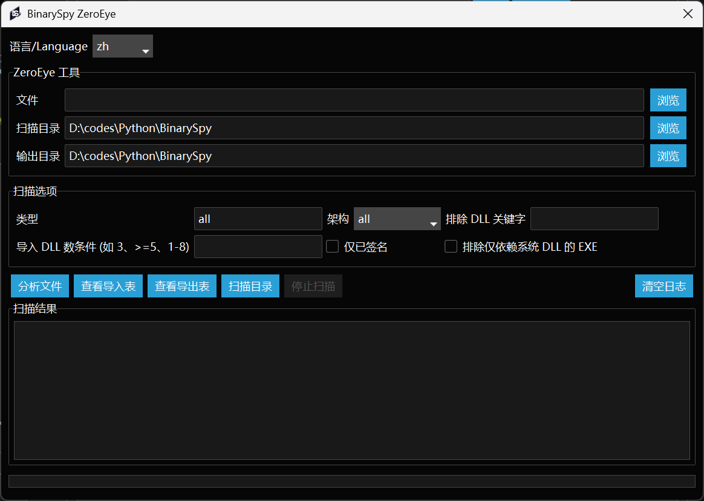
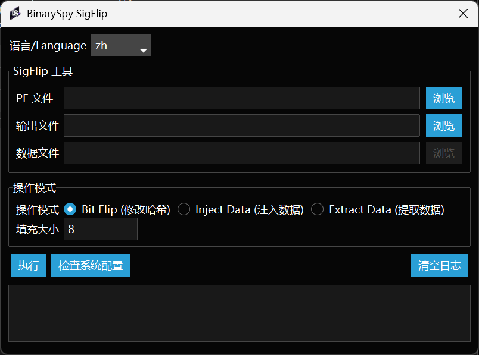

# BinarySpy

> 一个自动 patch shellcode 到二进制文件的工具，用于免杀研究

## 功能特性

- **双模式 Fuzz**
  - 自动分析模式：CFG + 调用链追踪 + 符号执行验证
  - 全部 Fuzz 模式：直接测试所有大函数
- **智能函数过滤** - 按调用深度、函数大小、符号执行可达性过滤
- **符号执行验证** - 验证函数是否真正从入口点可达
- **数字签名去除** - 自动备份并去除 PE 签名
- **现代暗色主题 UI** - 多种主题可选
- **多语言支持** - 中文/英文界面
- **缓存系统** - 加速重复分析

## 扩展工具

### ZeroEye

ZeroEye 是一款自动化白加黑扫描工具，支持原生PE、.NET程序、内核驱动三种类型。

**功能：**

- **原生PE扫描**：扫描导入表，自动复制非系统DLL，生成代理DLL模板
- **.NET扫描**：检测Config劫持/P/Invoke/Assembly侧加载向量
- **内核驱动扫描**：扫描IOCTL + 危险API（自动跳过微软签名驱动）
- **C++类重建**：从MSVC修饰名反向重建C++类结构，生成3种代理模板

**使用：** 点击主窗口的 `ZeroEye` 按钮打开工具。

### SigFlip

SigFlip 是基于证书表填充技术的签名操作工具。

**功能：**

- **Bit Flip**：添加随机填充修改PE哈希，不破坏签名
- **Inject**：在证书区域嵌入自定义数据（使用 `BinarySpy` 标签）
- **Extract**：从修改后的PE文件提取嵌入数据

**使用：** 点击主窗口的 `SigFlip` 按钮打开工具。

## 截图







## 快速开始

### 安装依赖

```bash
pip install pefile angr psutil ttkbootstrap
```

### 使用方法

1. 选择目标 PE 文件
2. 选择补丁源（或使用内置测试补丁）
3. 选择 Fuzz 模式：
   - **自动分析**：推荐大多数情况使用
   - **全部 Fuzz**：暴力测试所有大函数
4. 配置参数：
   - 测试延迟：等待进程启动的时间
   - 监控进程：要检测的进程名（如 `calc.exe`）
   - 最大调用深度：从入口点出发的调用深度限制
   - 最小函数大小：最小测试函数大小
   - 符号执行步数：仅启用符号执行时有效
5. 点击 **开始 Fuzz**

## 模式对比

| 功能         | 自动分析 | 全部 Fuzz |
| ------------ | -------- | --------- |
| CFG 分析     | 完整     | 基础      |
| 调用链追踪   | 是       | 否        |
| 符号执行     | 可选     | 否        |
| 调用深度过滤 | 是       | 否        |
| 函数大小过滤 | 是       | 是        |
| 速度         | 较慢     | 较快      |

## 参数说明

| 参数         | 说明                                                          |
| ------------ | ------------------------------------------------------------- |
| 测试延迟     | 等待目标进程启动的秒数                                        |
| 监控进程     | 要监控的进程名，逗号分隔（如 `calc.exe,CalculatorApp.exe`） |
| 最大调用深度 | 只测试从入口点出发该深度内的函数                              |
| 最小函数大小 | 只测试大于该大小的函数                                        |
| 符号执行步数 | 符号执行验证的最大步数                                        |

## 主题选项

可用的暗色主题：

- `cyborg` - 深灰/青色（默认）
- `darkly` - 深蓝/白色
- `vapor` - 深紫/粉色
- `superhero` - 深灰/橙色
- `pulse` - 深灰/蓝色

## 使用技巧

- 选择体积较大的 PE 文件作为目标
- 优先选择 GUI 子系统的 PE 文件（无黑框）
- shellcode 尽量小
- 自定义 shellcode 可使用 [CppDevShellcode](https://github.com/clownfive/CppDevShellcode)

## 工作流程

```
入口点 → CRT → Main → 目标函数
            ↓
       CFG 分析
            ↓
       调用链追踪
            ↓
       符号执行验证（可选）
            ↓
       Fuzz 测试
            ↓
       成功检测
```

## 参考资料

- [原分析文章](https://www.52pojie.cn/thread-1900852-1-1.html)
- [旧文章](old_README.md)
- [Zeroeye](https://github.com/ImCoriander/ZeroEye)
- [SigFlip](https://github.com/med0x2e/SigFlip)
- [PECracker](https://github.com/berryalen02/PECracker)

## 免责声明

本项目仅用于网络安全技术的学习研究。若执意要将本项目用于渗透测试等安全业务，需先确保已获得足够的法律授权，在符合网络安全法的条件下进行。使用者在使用本项目的过程中存在任何违法行为或造成任何不良影响，需使用者自行承担责任，与项目作者无关。

## Star History

<a href="https://star-history.com/#yj94/BinarySpy&Date">
 <picture>
   <source media="(prefers-color-scheme: dark)" srcset="https://api.star-history.com/svg?repos=yj94/BinarySpy&type=Date&theme=dark" />
   <source media="(prefers-color-scheme: light)" srcset="https://api.star-history.com/svg?repos=yj94/BinarySpy&type=Date" />
   
 </picture>
</a>
