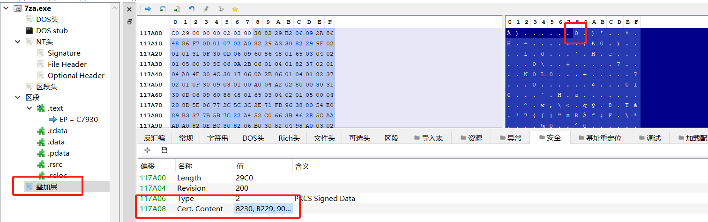
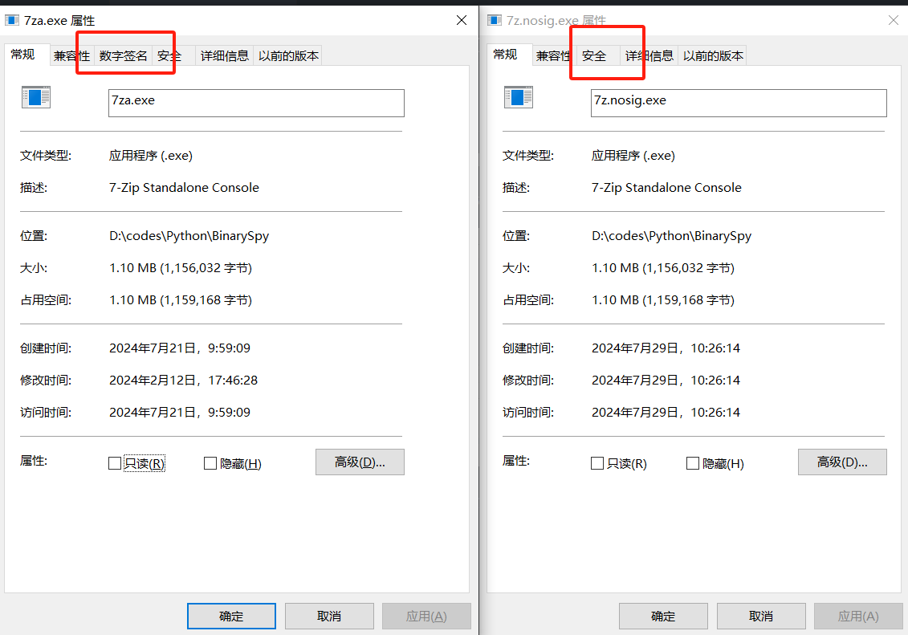

# 手动去除pe文件的数字签名，防止杀软以失效签名为特征

[RemovePeSign.exe](https://github.com/yj94/BinarySpy/blob/main/RemovePeSign.exe "RemovePeSign.exe")这个工具有点旧，不适配全部pe文件，所以这里给一个手动去除的教程

首先使用这个项目的工具 https://github.com/hasherezade/pe-bear

拖入进去后点叠加层->安全->Cert.content 把0改为1即可去除签名信息

注意 此方法适配windows，这样做只是导致签名伪清除 如果杀软不是以开头数据0作为特征辨别签名的话就无效！

对比

